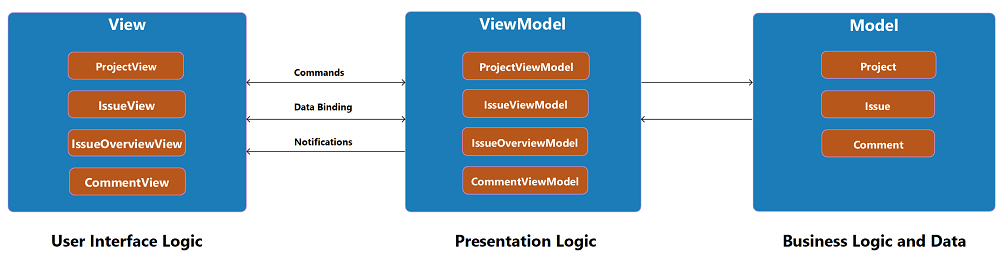

# BIMcollab Playground
[BIM Collaboration Format (BCF)](https://en.wikipedia.org/wiki/BIM_Collaboration_Format) client based on [BIMcollab Developer SDK](https://www.bimcollab.com/en/developers/Developer-SDK).

## Table of contents
* [General info](#general-info)
* [Components](#components)
* [Technologies](#technologies)
* [Setup](#setup)
* [Features](#features)
* [Status](#status)
* [Inspiration](#inspiration)
* [Licence](#licence)
* [Contact](#contact)

## General info

Project is an example how BIM Collaboration Format (BCF) client can be implemented using [BIMcollab Developer SDK](https://www.bimcollab.com/en/developers/Developer-SDK) Connection library (No GUI).

The BIM Collaboration Format (BCF) is a structured file format suited to issue tracking with a building information model.

Application is implemented using Model-View-ViewModel architectural pattern. Complete GUI is implemented using WPF.

## Components

## Technologies
* C#
* .NET Framework 4.8
* Visual studio 2017
* WPF (Windows Presentation Foundation)

## Setup
To run this project make sure you have installed:
* Visual Studio 2017 (at least)
* [.NET Framework 4.8 Developer Pack](https://dotnet.microsoft.com/download/visual-studio-sdks?utm_source=getdotnetsdk&utm_medium=referral)
* BIMcollab Developer SDK Libraries and Binaries are already part of the project

## Features

* Connecting to project on playground.bimcollab.com
* Overview of issues
* Detail overview of single issue
* Overview of issue comments

To-do list:
* Publish issues
* Add issue
* Edit issue
* Add comment
* Edit comment

## Status
Project is in progress.

## Inspiration
Project inspired by [BIMcollab BCF Manager](https://www.bimcollab.com/en/BCF-Manager/BCF-Manager).

## Licence

This project is licensed under the GNU GPL v3 License - see the [LICENSE.md](https://github.com/NikolaGrujic91/BIMcollab-Playground-WPF-Client/blob/master/LICENSE) file for details.

## Contact
Created by Nikola Grujic - feel free to contact me!

grujic.nikola91@gmail.com

[Nikola Grujic | LinkedIn](https://www.linkedin.com/in/nikola-grujic-735a7284/)